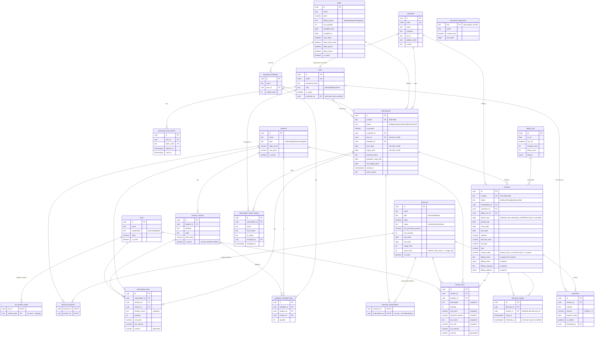

# Entity relationship diagram

Mermaid source for every table. Views (`v_*`) are derived and not drawn. Column lists show the
important fields only; the migrations are the full definition.

```mermaid
erDiagram
    customers ||--o| users : "login (role=customer)"
    users ||--o{ password_reset_tokens : has

    products ||--o{ product_variants : has
    taxes ||--o{ tax_product_types : "applies to types"
    plans ||--o{ quotation_templates : "used by"
    quotation_templates ||--o{ quotation_template_lines : has
    products ||--o{ quotation_template_lines : "in"
    product_variants |o--o{ quotation_template_lines : "optional"

    discounts ||--o{ discount_products : "scope=products"
    products ||--o{ discount_products : ""
    discounts ||--o{ discount_subscriptions : "scope=subscriptions"
    subscriptions ||--o{ discount_subscriptions : ""
    discounts ||--o{ discount_usages : "ledger"
    invoices ||--o{ discount_usages : ""

    customers ||--o{ subscriptions : owns
    plans ||--o{ subscriptions : "billed on"
    quotation_templates |o--o{ subscriptions : "started from"
    users |o--o{ subscriptions : "created_by"
    subscriptions ||--|{ subscription_lines : has
    products ||--o{ subscription_lines : ""
    product_variants |o--o{ subscription_lines : ""
    taxes |o--o{ subscription_lines : ""
    subscriptions ||--o{ subscription_status_history : audit
    users |o--o{ subscription_status_history : "changed_by"

    billing_runs ||--o{ invoices : generated
    subscriptions ||--o{ invoices : "billed as"
    customers ||--o{ invoices : "billed to"
    invoices ||--|{ invoice_lines : has
    products ||--o{ invoice_lines : ""
    discounts |o--o{ invoice_lines : ""
    taxes |o--o{ invoice_lines : ""
    invoices ||--o{ payments : "paid by"
    users |o--o{ payments : "recorded_by"

    customers {
        uuid id PK
        citext email UK
        text name
        text company
        text tax_id
        text address_line1
        text country
    }
    users {
        uuid id PK
        citext email UK
        text password_hash
        text role "admin|staff|customer"
        boolean is_active
        uuid customer_id FK "only when role=customer"
    }
    password_reset_tokens {
        uuid id PK
        uuid user_id FK
        text token_hash UK
        timestamptz expires_at
        timestamptz used_at
    }
    products {
        uuid id PK
        text name
        text type "software|addon|service|goods"
        numeric sales_price
        numeric cost_price
        boolean is_active
    }
    product_variants {
        uuid id PK
        uuid product_id FK
        text attribute
        text value
        numeric extra_price
        boolean is_active "archive instead of delete"
    }
    plans {
        uuid id PK
        text name
        numeric price
        text billing_period "daily|weekly|monthly|yearly"
        int min_quantity
        date available_from
        date available_to
        boolean auto_close
        boolean allow_early_close
        boolean allow_pause
        boolean allow_renew
        boolean is_active
    }
    taxes {
        uuid id PK
        text name
        text computation "percentage|fixed"
        numeric value
        boolean is_active
    }
    tax_product_types {
        uuid tax_id PK, FK
        text product_type PK "no rows = all types"
    }
    quotation_templates {
        uuid id PK
        text name
        uuid plan_id FK
        int validity_days
    }
    quotation_template_lines {
        uuid id PK
        uuid template_id FK
        uuid product_id FK
        uuid variant_id FK
        int quantity
    }
    discounts {
        uuid id PK
        text name
        text type "percentage|fixed"
        numeric value
        text scope "products|subscriptions"
        numeric min_purchase_amount
        int min_quantity
        date start_date
        date end_date
        int usage_limit
        int used_count "CHECK used_count <= usage_limit"
        boolean is_active
    }
    discount_products {
        uuid discount_id PK, FK
        uuid product_id PK, FK
    }
    discount_subscriptions {
        uuid discount_id PK, FK
        uuid subscription_id PK, FK "no rows = all subscriptions"
    }
    discount_usages {
        uuid id PK
        uuid discount_id FK
        uuid invoice_id FK "UNIQUE with discount_id"
        timestamptz used_at
        timestamptz released_at "set when invoice cancelled"
    }
    document_sequences {
        text key PK "subscription, invoice"
        text prefix
        boolean include_year
        bigint last_value
    }
    subscriptions {
        uuid id PK
        text number UK "SUB-0001"
        text status "draft|quotation|confirmed|active|closed"
        boolean is_paused
        uuid customer_id FK
        uuid plan_id FK "null only in draft"
        uuid template_id FK
        date start_date "null only in draft"
        date expiry_date "null only in draft"
        text payment_terms
        date quotation_valid_until
        date next_billing_date
        timestamptz closed_at
        text close_reason
    }
    subscription_lines {
        uuid id PK
        uuid subscription_id FK
        uuid product_id FK
        uuid variant_id FK
        text product_name "snapshot"
        int quantity
        numeric unit_price
        numeric tax_amount
        numeric amount "generated"
    }
    subscription_status_history {
        uuid id PK
        uuid subscription_id FK
        text event
        text from_status
        text to_status
        uuid changed_by FK
        timestamptz changed_at
    }
    billing_runs {
        uuid id PK
        date as_of
        boolean dry_run
        int created_count
        int failed_count
        jsonb failures
    }
    invoices {
        uuid id PK
        text number UK "INV-2026-0001"
        text status "draft|confirmed|paid|cancelled"
        uuid subscription_id FK
        uuid customer_id FK
        uuid billing_run_id FK
        date period_start "UNIQUE with subscription_id WHERE status<>cancelled"
        date period_end
        date issue_date
        date due_date
        numeric subtotal
        numeric discount_total
        numeric tax_total
        numeric total
        numeric amount_paid "amount_due, is_overdue only in v_invoices"
        text billing_name "snapshot of customer"
        citext billing_email "snapshot"
        text billing_company "snapshot"
        jsonb billing_address "snapshot"
    }
    invoice_lines {
        uuid id PK
        uuid invoice_id FK
        uuid product_id FK
        text description "snapshot"
        int quantity
        numeric unit_price "snapshot"
        numeric discount_amount "snapshot"
        text tax_name "snapshot"
        numeric tax_rate "snapshot"
        numeric tax_amount
        numeric amount "generated"
    }
    payments {
        uuid id PK
        uuid invoice_id FK
        text method
        numeric amount "CHECK > 0"
        date payment_date
        boolean is_voided
        uuid recorded_by FK
    }
```
